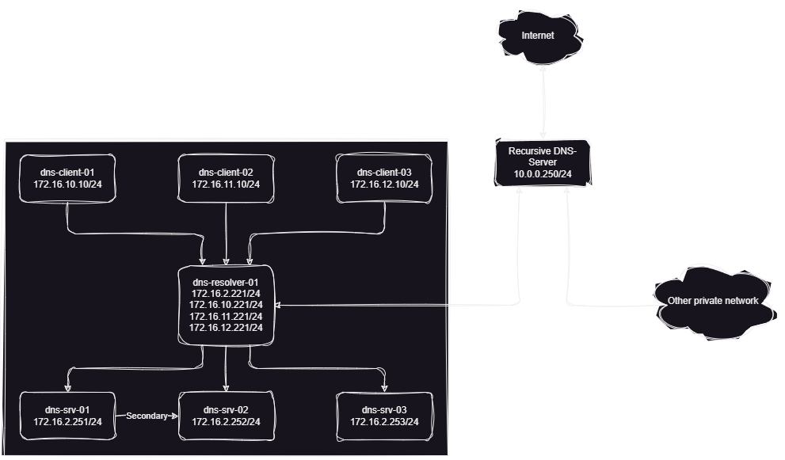

# bind9-resolver-example

Bind9 Selective Forwarding Resolver Configuration Example.

---

## Motivation

I recently came up with the idea to increase my knowledge regarding some of the
basic features which keep the internet running. Naturally, one of the first
things to pick up would be the Domain Name System (DNS) which, in my opinion, is
literally the backbone of everything we know as the modern internet today.

With some basic knowledge about how DNS works, I started with some basic Bind9
configuration which led me rather fast to a working recursive DNS resolver.
Being the person I am, I quickly decided that while this was fun, I did not
really learn anything about how to set up more complex scenarios. This led to
several hours thinking about a mode complex setup and ultimately ended with days
of intense configuration, troubleshooting and reconfiguration.

During this journey I encountered some rather interesting problems which brought
me to writing this example and providing my final configuration in this
repository.

One final think I want to address:
I am not an expert of DNS. Please do not use any of this code in your
environment if you do not know what you do (this is a general advice, you should
never use untested or code you do not understand).

---

## Scenario

The assumed scenario configured is as follows:

* We have three clients (located in different subnets and DNS-Domains)
* For simplification, each subnet has its own DNS-Domains and vice versa
* We have one central DNS forwarding resolver configured
* We have three authoritative DNS-Server providing the forwarding mapping zone
  data
* We host the following zones:
  * `foo.bar`
    Contains our three DNS-Server (`dns-srv-[01-03]`), one A RR for the DNS
    resolver (`dns-resolver-01`) and CNAMEs for our clients (`client-[01-03]`)
  * `a.foo.bar`
    The domain for our test client 1 (`dns-client-01`)
  * `b.foo.bar`
    The domain for our test client 2 (`dns-client-02`)
  * `c.foo.bar`
    The domain for our test client 3 (`dns-client-03`)
* We have one primary-secondary DNS-Server pair (`dns-srv-[01-02]`, providing
  authoritative answers for the zones `foo.bar`, `a.foo.bar` and `b.foo.bar`
* We have one primary DNS-Server (`dns-srv-03`) which provides authoritative
  answers for the zone `c.foo.bar`
* We do not have to consider reverse mapping zone delegation
* We have another recursive server already in place which we can forward any
  other DNS-Queries to
* Our existing setup is only part of a larger private network we do not know
  much about, so we have to forward queries for reverse mapping entries for
  private networks to the existing forwarder as well

For simplification, I decided to use separate reverse mapping zones for each
forward mapping zone:

* `172.16.2.0/24` - `foo.bar`
* `172.16.10.0/24` - `a.foo.bar`
* `172.16.11.0/24` - `b.foo.bar`
* `172.16.12.0/24` - `c.foo.bar`

I asigned the following IP addresses to the server/clients included in this
setup:

* `172.16.2.221` for `dns-resolver-01.foo.bar.`
* `172.16.2.251` for `dns-srv-01.foo.bar.`
* `172.16.2.252` for `dns-srv-02.foo.bar.`
* `172.16.2.253` for `dns-srv-03.foo.bar.`
* `172.16.10.10` for `dns-client-01.a.foo.bar.`
* `172.16.10.221` for `dns-resolver-01.a.foo.bar.`
* `172.16.11.10` for `dns-client-02.b.foo.bar.`
* `172.16.11.221` for `dns-resolver-01.b.foo.bar.`
* `172.16.12.10` for `dns-client-03.c.foo.bar.`
* `172.16.12.221` for `dns-resolver-01.c.foo.bar.`
* `10.0.0.250` for the upstream recursive DNS resolver

Putting everything together, the scenario looks something like this:

---

## Configuration

Before I jump into the configuration (and this is were I will also point to the
main challenge I faced):

* I used Ubuntu 22.04
* I used the Bind9 version provided by the system package manager (`9.18.20`)
* I discovered quiete early, that I like to have my configuration files for all
  of my servers organized in a specific way which differs from the system
  default
  * All configuration files life inside `/etc/named/` or a subfolder
  * All zone files life inside `/etc/named/zones`
  * I use the main `named.conf` file only to include other configuration
    snippets
  * All configuration snippets life inside `/etc/named/conf.d`
  * Transfered zones, logs etc. life at `/var/named` or a subfolder
* I always configured rndc to manage my server
  * Configuration file lifes at `/etc/named/`
  * Configuration files for rndc are not included in this repository
* I adapted the systemd service file
  * To not check for configured systemd
  * To not load any external environment file

I configured the server in the following order:

* Primary name server for `foo.bar`, `a.foo.bar` and `b.foo.bar` (`dns-srv-01`)
* Secondary name server for `foo.bar`, `a.foo.bar` and `b.foo.bar`
  (`dns-srv-02`)
* Primary name server for `c.foo.bar` (`dns-srv-03`)
* Forwarding resolver (`dns-resolver-01`)
* Clients (`dns-client-[01-03]`)

---

### dns-srv-01

The configuration of `dns-srv-01` consists of six files (excluding the acutal
zone files) which are used to define the server behaviour.
As mentioned above, one of those files is the base `/etc/named/named.conf` file,
which glues everything together:

~~~bash
include "/etc/named/conf.d/acl.conf";
include "/etc/named/conf.d/options.conf";
include "/etc/named/conf.d/logging.conf";
include "/etc/named/conf.d/named.rfc1912.zones";
include "/etc/named/conf.d/zones.conf";
~~~

For the sake of readability, I will only show the content of the `acl.conf` and
`options.conf` file here.

I basically first set up the ACL I wanted to use in the project, configured the
global server behaviour and logging before I started to define the zones served
by the server.

The ACL setup is pretty straight forward to, defining only the secondary server
I want to use for zone replication:

~~~bash
acl acl_secondaries {
  172.16.2.252;
};
~~~

Now, the fun part started. I went ahead and created the `options.conf` file and
my first attempt ended in something like this:

~~~bash
options {
  directory "/var/named";
  version "not currently available";
  listen-on port 53 { 172.16.2.251; };
  listen-on-v6 { none; };

  recursion no;

  allow-notify { none; };
  allow-query { any; };
  allow-query-cache { none; };
  allow-recursion { none; };
  allow-update { none; };
  allow-transfer { acl_secondaries; };

  empty-zones-enable no;
  pid-file "/run/named/named.pid";
  qname-minimization relaxed;
  zone-statistics none;
  notify yes;

  dnssec-policy none;
  dnssec-validation no;

  include "/etc/crypto-policies/back-ends/bind.config";
};
~~~

This configuration lead to the main problem which cosumed most of the time spend
on this project. As you may have noticed I set `allow-recursion` to `none` in
the above configuration snippet. Whith the server configured to serve the zones
`foo.bar` and the sub-zones `a.foo.bar` and `b.foo.bar` (which were delegated in
the `foo.bar` zone), and having CNAME RRs for the three test clients inside
`foo.bar`, resolving any of those CNAME RRs ended in something like this:

~~~bash
# dig -4 +short @172.16.2.251 client-01.foo.bar
dns-client-01.a.foo.bar
~~~

And that's it. No further resolution of the CNAME RR. I will come back to this
later in the `dns-resolver-01` section as well providing the solution I had
found.

The full configuration (including zone files and comments) can be found at
`Configuration/dns-srv-01` inside this repository.

### dns-srv-02

The configuration (including zone files and comments) can be found at
`Configuration/dns-srv-02` inside this repository.

### dns-srv-03

This server is bacically a copy of `dns-srv-01` so I will only point out the
configuration differences in the `options.conf` file here.

~~~bash
listen-on port 53 { 172.16.2.253; };
allow-transfer { none; };
~~~

And that is everything that changed (except the served zones.)

The full configuration (including zone files and comments) can be found at
`Configuration/dns-srv-03` inside this repository.

### dns-resolver-01

I again took the same approach I used for the `dns-srv-[01-03]`.

Main `/etc/named/named.conf` file content:

~~~bash
include "/etc/named/conf.d/acl.conf";
include "/etc/named/conf.d/options.conf";
include "/etc/named/conf.d/logging.conf";
include "/etc/named/named.rfc1912.zones";
include "/etc/named/conf.d/zones.conf";
~~~

Setup ACLs to allow queries from all of our known networks (so we only have to
maintain the information onetime):

~~~bash
acl acl_allowed_nets {
  10.0.0.250;
  172.16.2.0/24;
  172.16.10.0/24;
  172.16.11.0/24;
  172.16.12.0/24;
};
~~~

The `option.conf` file however has some more configuration, as we do not act as
an authoritative server, but a selective forwarder instead:

~~~bash
options {
  directory "/var/named";
  version "not currently available";

  listen-on port 53 {
    172.16.2.221;
    172.16.10.221;
    172.16.11.221;
    172.16.12.221;
  };
  listen-on-v6 { none; };

  recursion yes;
  forwarders { 10.0.0.250; };
  forward only;

  allow-notify { none; };
  allow-query { acl_allowed_nets; };
  allow-query-cache { acl_allowed_nets; };
  allow-recursion { acl_allowed_nets; };
  allow-update { none; };
  allow-transfer { none; };

  empty-zones-enable no;
  pid-file "/run/named/named.pid";
  qname-minimization relaxed;
  zone-statistics none;

  dnssec-policy none;
  dnssec-validation no;

  include "/etc/crypto-policies/back-ends/bind.config";
};
~~~

This configuration enables this server to perform iterative queries for all
queries send to him and store the answers inside his cache, reducing the answer
time for further queries for the same RR.

~~~bash
recursion yes;
~~~

By defining `forwarders` we tell the server to send all queries to other servers
if not specified otherwise in a view or zone. By also setting `forward only` we
further specify, that we do not fallback to recursion ourself.

~~~bash
forwarders { 10.0.0.250; };
forward only;
~~~

Everything that is left is to specify who is allowed to

* Query the server
* Access the query cache of the server
* Send recursive queries to the server

This is done by refering our defined ACL:

~~~bash
allow-query { acl_allowed_nets; };
allow-query-cache { acl_allowed_nets; };
allow-recursion { acl_allowed_nets; };
~~~

Next up we have to define the zones we want to forward to our own DNS-Server.
This is done inside the file `zones.conf`:

~~~bash
zone "foo.bar" {
  type forward;
  forwarders {
    172.16.2.251;
    172.16.2.252;
  };
  forward only;
};

zone "16.172.in-addr.arpa" {
  type forward;
  forwarders {
    172.16.2.251;
    172.16.2.252;
  };
  forward only;
};

zone "c.foo.bar" {
  type forward;
  forwarders {
    172.16.2.253;
  };
  forward only;
};

zone "12.16.172.in-addr.arpa" {
  type forward;
  forwarders {
    172.16.2.253;
  };
  forward only;
};
~~~

And that's it, right? Our queries for any (sub)-domain of either `foo.bar` or
`16.172.in-addr.arpa` will be forwarded to our server `dns-srv-[01-02]` and
queries for `c.foo.bar` and `12.16.172.in-addr.arpa` will be forwarded to
`dns-srv-03`.

Or so I thought.

While the resolution of A record worked, I still had this nasty problem, that
CNAMES were not resolved to an IP:

~~~bash
# dig -4 +short @172.16.10.251 dns-client-02.b.foo.bar
172.16.11.10

# dig -4 +short @172.16.10.251 client-01.foo.bar
dns-client-01.a.foo.bar

# dig -4 +short @172.16.10.251 dns-client-01.a.foo.bar
172.16.10.10
~~~

The first thing I did was to setup something like this inside the `zone.conf`
file at the `dns-resolver-01`:

~~~bash
zone "foo.bar" {
  type forward;
  forwarders {
    172.16.2.251;
    172.16.2.252;
  };
  forward only;
};

zone "*.foo.bar" {
  type forward;
  forwarders {
    172.16.2.251;
    172.16.2.252;
  };
  forward only;
};

zone "16.172.in-addr.arpa" {
  type forward;
  forwarders {
    172.16.2.251;
    172.16.2.252;
  };
  forward only;
};

zone "*.16.172.in-addr.arpa" {
  type forward;
  forwarders {
    172.16.2.251;
    172.16.2.252;
  };
  forward only;
};

zone "c.foo.bar" {
  type forward;
  forwarders {
    172.16.2.253;
  };
  forward only;
};

zone "12.16.172.in-addr.arpa" {
  type forward;
  forwarders {
    172.16.2.253;
  };
  forward only;
};
~~~

This acutally solved the problem. Great... But left me with the impression that
I can do better.

I referted those changes and again reviewed the configuration file of the
`dns-srv-[01-03]`. And after reading the documentation once again, focussed at
the default values, I made the following change to the `options.conf` file at
all of my authoritative DNS-Servers:

~~~bash
allow-recursion {
  localnets;
  localhost;
};
~~~

After flushing the cache of my resolver, I ended up with a working CNAME
resolution:

~~~bash
# dig -4 +short @172.16.10.221 client-01.foo.bar
dns-client-01.a.foo.bar
172.16.10.10

# dig -4 +short @172.16.10.221 client-02.foo.bar
dns-client-02.b.foo.bar
172.16.11.10

# dig -4 +short @172.16.10.221 client-03.foo.bar
dns-client-03.c.foo.bar
172.16.12.10
~~~

---

## Conclusion

After I finished troubleshooting, created all of the configuration provided by
this repository and performed a lot of tests, the last part of learning
something is always to draw a conclusion.

One thing I did take with me during this learning experience was a lot of
knowledge about the various roles a (simple) Bind9 server can take. This makes
it an incredible tool which can be a beast to first understand. However, once
the conceptional idea is clear, it becomes a lot more natural to configure the
various parts.

I also learned a lot about (selective) forwarding of queries, recursive and
iterative queries and once again was reminded, how important a good logging
configuration is to ease troubleshooting.

The final thing I took with me is, that while the documentation of Bind9 from
ISC at [readthedocs.io][1] is already great, it does not cover all the
possibilities which can be performed by using Bind9 (which is most likely due to
the vast amount of configuration scenarios). Thankfully, the internet is full of
configuration references, ideas and configuration snippets which helped me a lot
during this project. The hard part is simply to find and put those peaces
together.

[1]: https://bind9.readthedocs.io/en/latest/
